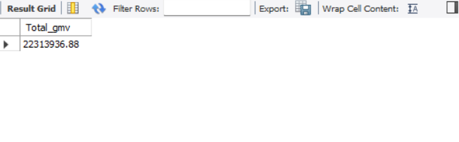
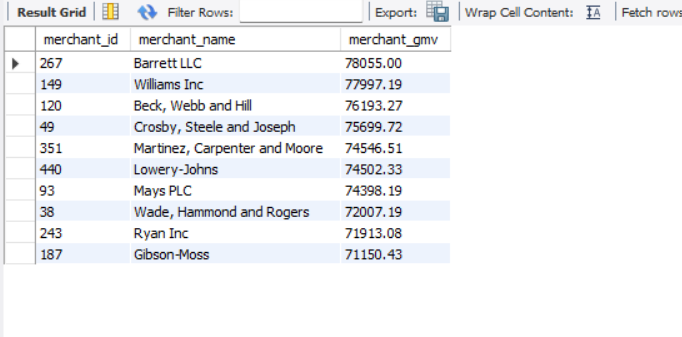
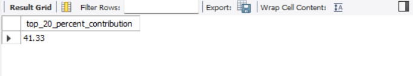
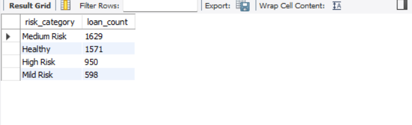
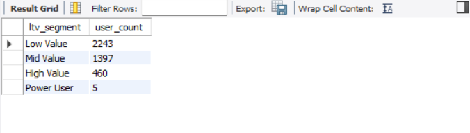
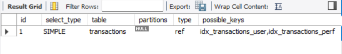

# Fintech Transaction & Credit Risk Analytics System

End-to-end fintech analytics system built using Python and MySQL.  
Simulates realistic financial data and performs revenue, risk, lifecycle, and performance analysis using advanced SQL.

---

## Dataset Scale

- 5,000 Users  
- 500 Merchants  
- 70,000 Transactions  
- 5,000 Loans  
- 15,000 Repayments  

---

## System Architecture

Schema Design → Data Generation → SQL Analytics → Query Optimization

- Relational schema built in MySQL
- Synthetic fintech data generated using Python (Faker)
- Revenue, credit risk, LTV, and cohort analytics implemented using SQL
- Query performance improved using indexing and EXPLAIN analysis

---

## Revenue Analytics

- Total GMV computation  
- Merchant revenue ranking  
- Revenue concentration (Top 20% users)

### Sample Outputs

  
  

---

## Credit Risk Modeling

- Loan default rate calculation  
- Loan-level risk segmentation  
- Exposure distribution by risk bucket  

### Sample Output

---

## User Lifecycle & LTV

- User lifetime value calculation  
- LTV segmentation  
- Revenue contribution by user tier  

### Sample Output

---

## Query Optimization

- Execution plan analysis using EXPLAIN  
- Composite indexing for performance improvement  

### Sample Output

---

## Technical Skills Demonstrated

- Relational database modeling  
- Advanced SQL (CTEs, window functions)  
- Financial metrics computation  
- Risk modeling logic  
- Cohort retention analysis  
- Query performance tuning  

---

## How to Run

1. Execute `database/schema.sql`
2. Run `data_generation/data_generator.py`
3. Execute SQL queries inside `analytics/`